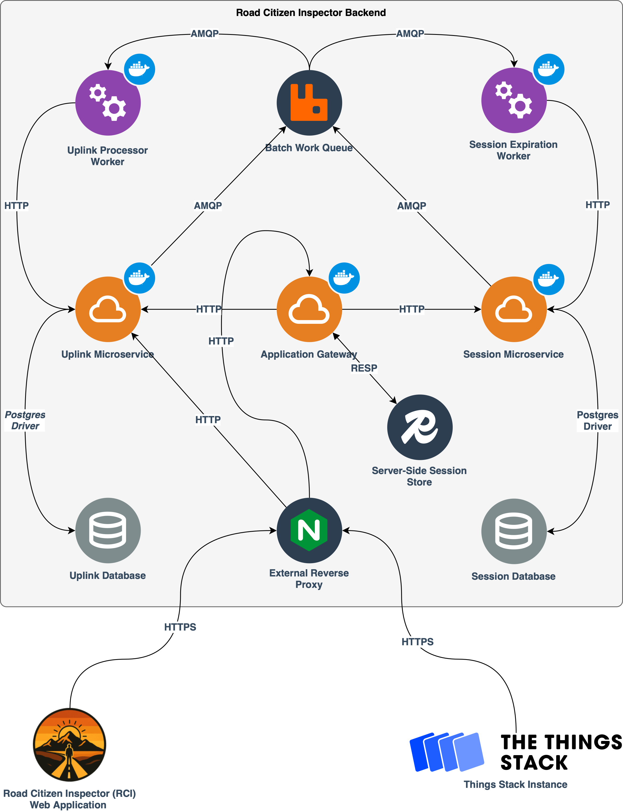

# road-citizen-inspector-public

    
The Road Citizen Inspector is software platform built as part of the Master's thesis titled "Citizen Infrastructure for Traffic Monitoring Using LoRaWAN Technology" at the University of Nevada, Reno in May 2026. It is available on ProQuest and is accessible [here]([here](https://guides.library.unr.edu/pqdt-unr)). The system architecture and design of the microservices are better described within the thesis. For quick reference, an overview of the software architecture is shown below.

## Deploying for Evaluation
If you like to deploy for quick evaluation you may use the following steps below to use the application.

## Deploying Locally
If you like to deploy for usage with the ThingsStack, you may use the following steps below to use the application.

## Generating Mock Data
If you like to generate mock data and seed the application's databases you may use the following steps below to use a seeding script.
